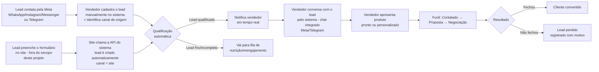
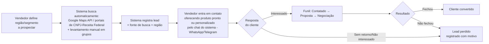
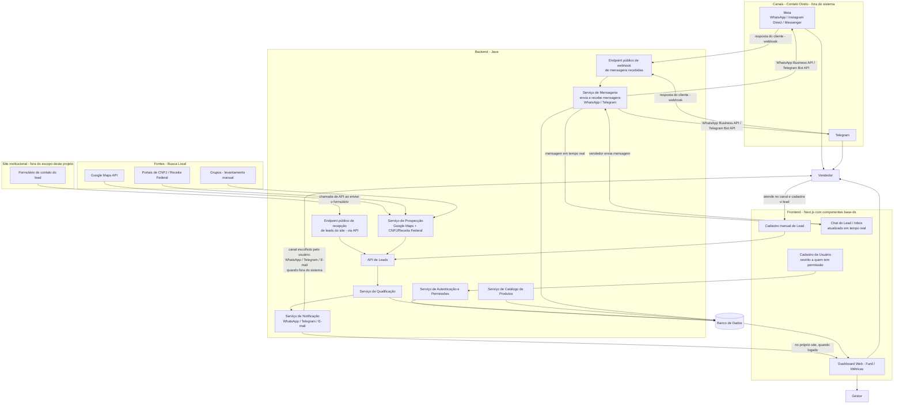

# Estudo de Caso: Sistema de Coleta e Qualificação de Leads para Venda de Sistemas Digitais

## Resumo Executivo

Empresas que desenvolvem e vendem sistemas digitais — sejam **produtos prontos** (soluções padronizadas, prontas para uso) ou **produtos personalizados** (sob medida para a necessidade do cliente) — costumam captar clientes de duas formas muito diferentes: recebendo contatos espontâneos (WhatsApp, Instagram, formulário do site) e **buscando ativamente** clientes em potencial em plataformas públicas (Google Maps, sistemas de governo, grupos). O resultado, quando isso não é organizado, é previsível: leads se perdem, o tempo de resposta é lento, ninguém sabe qual canal ou qual abordagem realmente traz clientes, e o funil comercial vive na cabeça do vendedor (ou no seu chat pessoal).

Este documento propõe um **sistema centralizado de coleta e qualificação de leads**, pensado para uma software house / desenvolvedor(a) que vende produtos digitais prontos ou personalizados. O sistema trata dois tipos de lead de forma distinta e complementar — **leads de contato direto** (o cliente procura a empresa) e **leads de busca local** (a empresa procura o cliente) — unificando ambos em um único funil comercial, com qualificação automática, notificação em tempo real da equipe e métricas claras de conversão por canal e por tipo de lead. Após o primeiro contato, toda a **conversa com o lead passa a acontecer dentro do próprio sistema** — o vendedor envia e recebe mensagens sem precisar abrir o WhatsApp, o Telegram ou qualquer outro aplicativo à parte, e todo o histórico fica registrado junto ao lead.

---

## Contexto e Problema de Negócio

**Cenário atual (dor):**

- Leads de contato direto chegam por múltiplos canais soltos: WhatsApp, Telegram, Direct do Instagram, DM do Facebook, outras redes sociais e formulário do site — cada um com informações diferentes e sem padronização.
- Leads de busca local (prospecção ativa) são levantados manualmente — alguém pesquisa empresas no Google Maps ou em grupos, anota em uma planilha ou bloco de notas, e o contato é feito sem processo nem registro estruturado.
- Não há padronização: uns leads trazem orçamento e detalhes do projeto, outros só um "oi, vi seu trabalho"; leads de busca local muitas vezes nem têm um responsável definido para o primeiro contato.
- A resposta depende de alguém lembrar de checar cada canal manualmente — leads esfriam ou são esquecidos.
- Não existe rastreio de origem: é impossível saber se o cliente veio do Instagram, de uma busca no Google Maps ou de um grupo.
- Sem funil visual, o dono do negócio não sabe quantos leads estão "em negociação" vs. "só curiosos" vs. "já fechou" — nem se a prospecção ativa (busca local) está valendo o esforço frente aos leads de contato direto.
- Decisões de marketing e de prospecção (onde investir tempo, em qual região buscar clientes) são feitas no feeling, sem dado de conversão por canal ou por tipo de lead.

**Consequência direta:** perda de vendas por demora na resposta, esforço comercial desperdiçado com leads não qualificados, prospecção ativa sem critério nem retorno mensurável, e nenhuma visibilidade sobre o que está gerando resultado.

---

## Objetivos do Sistema

1. **Oferecer um catálogo de produtos** — prontos ou personalizados — que possa ser apresentado ao lead durante a qualificação e a negociação.
2. **Centralizar a captação** de leads vindos dos dois tipos de origem — contato direto e busca local — em um único lugar.
3. **Qualificar automaticamente** os leads com base em critérios simples (produto de interesse, orçamento estimado, urgência, porte do negócio do cliente).
4. **Notificar a equipe comercial em tempo real** assim que um lead qualificado entra no sistema.
5. **Organizar o funil de vendas** em etapas claras: Novo → Contatado → Proposta enviada → Negociação → Fechado / Perdido, independentemente do tipo de lead.
6. **Gerar métricas de conversão por canal e por tipo de lead** (contato direto vs. busca local), permitindo decisões de marketing e de prospecção baseadas em dado, não em intuição.
7. **Centralizar a conversa com o lead dentro do sistema**: depois do primeiro contato, o vendedor troca mensagens com o lead (via WhatsApp e Telegram) diretamente pela interface do sistema, com todo o histórico preservado junto ao registro do lead.

---

## Personas / Usuários do Sistema

| Persona | Descrição | Necessidade principal |
|---|---|---|
| **Lead (contato direto)** | Pessoa ou empresa que procura espontaneamente a software house por WhatsApp, Telegram, redes sociais ou site | Falar com facilidade pelo canal de sua preferência e ser respondido rápido |
| **Lead (busca local)** | Empresa local ou de uma região específica, encontrada pela software house em fontes públicas, que ainda não conhece o produto | Receber uma abordagem clara e relevante sobre um produto pronto ou personalizado que resolva sua necessidade |
| **Vendedor / Comercial** | Pessoa (pode ser o próprio dono do negócio) que atende leads de contato direto **e** realiza a prospecção ativa (busca local), conduzindo ambos até o fechamento | Ver todos os leads organizados num único funil, saber quem priorizar, registrar buscas, conversar com o lead sem trocar de aplicativo e não deixar ninguém esquecido |
| **Gestor / Administrador** | Dono/responsável pelo negócio, acompanha o desempenho comercial e administra o acesso ao sistema | Enxergar métricas: quantos leads, de onde vêm (canal e tipo), taxa de conversão, gargalos do funil; controlar quem tem acesso ao sistema e com quais permissões |

> Todo usuário do sistema (Vendedor ou Gestor) é uma conta interna, criada por alguém com permissão de administração — não existe autocadastro. Ver [Controle de Acesso e Permissões](#controle-de-acesso-e-permissões).

---

## Controle de Acesso e Permissões

O sistema é **fechado por padrão**: não existe formulário de registro/cadastro público (nem para vendedor nem para gestor). Uma conta de usuário só é criada por alguém que já possui permissão de administração dentro do próprio sistema — o acesso nasce sempre "de dentro para dentro", nunca por autocadastro externo.

- **Controle por permissões**: cada usuário recebe um papel (ex.: Vendedor, Gestor/Administrador) associado a um conjunto de permissões granulares (ex.: ver todos os leads vs. só os próprios, cadastrar novo usuário, editar catálogo de produtos, ver métricas, disparar buscas de prospecção).
- **Cadastro de novos usuários**: exclusivo de quem possui a permissão correspondente (tipicamente o Gestor/Administrador). Um novo vendedor só passa a acessar o sistema depois de ser cadastrado internamente.
- **Sem tela de "criar conta" ou "esqueci minha senha" self-service pública**: o fluxo de acesso (convite, definição de senha, recuperação) é sempre iniciado ou aprovado por um administrador.
- Esse modelo se aplica **apenas ao acesso ao sistema em si** — é diferente do formulário de captação de leads do site (ver seção seguinte), que continua público, pois seu propósito é justamente captar visitantes desconhecidos como potenciais clientes.
- **O site institucional com o formulário de contato está fora do escopo deste projeto.** Este projeto entrega apenas o **endpoint de API** que recebe a submissão do formulário e cria o lead no sistema — a construção, hospedagem e manutenção do site em si (e do formulário nele embutido) são de responsabilidade de outra frente. Esse endpoint público não exige login (não se aplica o modelo de permissões de usuário), mas deve ter proteção própria (ex.: chave de API/token de integração, validação de payload, rate limiting) para evitar abuso.

---

## Tipos de Lead e Canais de Captação

O sistema trata as leads de **duas formas**, com naturezas e canais de entrada distintos, mas que convergem para o mesmo funil comercial.

### 1. Leads de Contato Direto (inbound)

O cliente é quem procura a empresa. **Canais suportados na primeira versão (MVP):**

- **Meta** — WhatsApp, Instagram Direct e Facebook Messenger, tratados como um único grupo de canais da Meta.
- **Telegram**
- **Formulário do site**

> Outras redes sociais serão adicionadas como canal em fases futuras, conforme demanda.

Os dois grupos de canais têm formas diferentes de entrada no sistema:

- **Meta e Telegram**: não há integração automatizada para **detectar e criar o lead sozinho** a partir da primeira mensagem — então **o registro do lead é sempre feito pelo próprio usuário (vendedor)** — ele atende o cliente no canal de origem e, em seguida, cadastra manualmente o lead no sistema, informando o canal de origem, a mensagem/contexto e os dados de qualificação. A partir daí, porém, a **conversa passa a ser feita pelo sistema**: o sistema se integra à WhatsApp Business Platform e à API do Telegram para que o vendedor envie e receba as mensagens seguintes sem sair do sistema (ver seção "Central de Mensagens" em Funcionalidades Propostas).
- **Formulário do site**: o site institucional que hospeda o formulário está **fora do escopo deste projeto**. O cliente preenche o formulário no site; ao ser enviado, o próprio site faz uma **chamada de API** para este sistema, que recebe os dados e cria o lead automaticamente, já identificado como vindo do canal "site" — sem necessidade de cadastro manual pelo vendedor nesse caso.

### 2. Leads de Busca Local (outbound / prospecção ativa)

A empresa é quem procura o cliente. O sistema busca ativamente empresas locais — ou de uma região previamente escolhida — usando **fontes públicas**:

- **Google Maps** (API do Google Maps/Places): busca de empresas locais por região, segmento e palavra-chave.
- **Portais de CNPJ / Receita Federal e cadastros públicos de empresas**: busca de empresas por CNAE, situação cadastral e localização.
- **Grupos** (redes sociais, WhatsApp, comunidades locais) — levantamento manual, complementar às buscas automatizadas acima.

As buscas via Google Maps e portais de CNPJ/Receita Federal são feitas pelo próprio sistema (integração com essas fontes), enquanto o levantamento em grupos permanece manual. Em ambos os casos, cada empresa encontrada é registrada como lead com a região e a fonte de busca associadas, entrando no funil como um lead de busca local a ser contatado pelo vendedor.

---

## Fluxo Principal (Jornada do Lead)

### Fluxo A — Contato Direto (inbound)

### Fluxo B — Busca Local (outbound / prospecção ativa)

**Etapas do funil comercial (comum aos dois fluxos):**

`Novo` → `Contatado` → `Proposta enviada` → `Em negociação` → `Fechado` (ou `Perdido`, com motivo registrado)

---

## Funcionalidades Propostas

### MVP (primeira versão)

- **Sistema de permissões de usuários**: papéis e permissões granulares controlando o que cada usuário pode ver e fazer no sistema; cadastro de novo usuário restrito a quem possui a permissão de administração (ver [Controle de Acesso e Permissões](#controle-de-acesso-e-permissões)).
- **Catálogo de produtos**: cadastro de produtos prontos e personalizados, apresentável ao lead durante a qualificação e a proposta.
- **Captação (contato direto)**: cadastro manual do lead pelo vendedor, feito após o atendimento nos canais da Meta (WhatsApp, Instagram Direct, Messenger) ou Telegram — sem integração automática (webhook) nesta primeira versão; **+ endpoint de API** que recebe automaticamente as submissões do formulário do site (o site em si é externo e está fora do escopo deste projeto) e cria o lead sem intervenção manual.
- **Módulo de busca local (prospecção)**: busca automatizada de empresas via **API do Google Maps** e via **portais de CNPJ/Receita Federal e cadastros públicos de empresas**, complementada por levantamento manual em grupos, com registro da região, fonte e responsável pela busca.
- **Qualificação automática básica**: perguntas-chave (produto de interesse, orçamento estimado, prazo desejado) geram uma pontuação simples (score alto/médio/baixo), aplicada a ambos os tipos de lead.
- **Dashboard de funil (estilo Kanban)**: colunas por etapa do funil, cards de leads arrastáveis, com indicação visual do tipo de lead (contato direto ou busca local).
- **Central de mensagens (chat integrado)**: depois que o lead está cadastrado, toda a conversa seguinte acontece dentro do sistema — o vendedor envia mensagens que são entregues ao cliente via **WhatsApp Business Platform** ou **Telegram Bot API**, e as respostas do cliente chegam de volta ao sistema (via webhook) e aparecem na conversa do lead em tempo real, sem o vendedor precisar abrir o aplicativo do canal.
- **Notificações configuráveis por usuário**: cada usuário escolhe por quais canais quer ser notificado — **WhatsApp, Telegram e/ou e-mail** — usados quando ele não está com o sistema aberto; quando está logado, a notificação aparece no próprio site/dashboard.
- **Registro de origem do canal**: cada lead guarda de onde veio — canal (para contato direto) ou fonte de busca + região (para busca local).

> **Componentes de interface**: toda a construção de telas (dashboard, formulários, catálogo) deve utilizar os componentes já disponíveis no **base-ds** ([github.com/indianous/base-ds](https://github.com/indianous/base-ds)). Caso um componente necessário não exista na base-ds, o time deve **abrir uma issue no repositório do base-ds** solicitando sua criação antes de implementar um componente avulso fora do design system.
>
> **Metodologia de desenvolvimento**: todo o desenvolvimento do sistema (backend e frontend) segue **TDD (Test-Driven Development)** — os testes são escritos antes da implementação de cada funcionalidade, guiando o design do código e servindo como rede de segurança para refatorações futuras.

### Futuro (evolução)

- **Novos canais de contato direto**: expansão gradual para outras redes sociais além dos canais da Meta, Telegram e site (ex.: LinkedIn, TikTok, outras plataformas relevantes ao negócio).
- **Criação automática do lead a partir da primeira mensagem**: hoje o webhook de Meta/Telegram já alimenta a central de mensagens, mas a criação do registro de Lead em si ainda é manual; no futuro, a primeira mensagem recebida por um contato desconhecido pode criar o lead automaticamente, reduzindo o cadastro manual do vendedor.
- Integração com CRMs externos (ex: RD Station, HubSpot) para quem já usa uma ferramenta consolidada.
- Automação de follow-up (mensagens automáticas para leads que não respondem em X dias).
- Ampliação das fontes de busca local (ex: outras bases públicas além de Google Maps e portais de CNPJ/Receita Federal, importação assistida de grupos), respeitando os termos de uso das plataformas.
- Relatórios avançados (funil por período, ticket médio por canal/tipo de lead, tempo médio até fechamento).
- Priorização de leads com IA (análise de texto da mensagem para inferir intenção/urgência, tanto em contato direto quanto na abordagem de busca local).

---

## Arquitetura de Alto Nível

**Stack sugerida** (ponto de partida, ajustável conforme preferência da equipe):

- **Backend**: **Java** (ex.: Spring Boot) expondo uma API REST para autenticação/permissões, ingestão e consulta de leads, catálogo de produtos, qualificação e prospecção — incluindo um **endpoint público** dedicado a receber a submissão do formulário do site institucional (que é externo e está fora do escopo deste projeto).
- **Banco de dados**: PostgreSQL — bom equilíbrio entre estrutura relacional (funil, status, produtos, usuários/permissões) e simplicidade.
- **Frontend/Dashboard**: **Next.js**, construído sempre com os componentes disponíveis no **base-ds** ([github.com/indianous/base-ds](https://github.com/indianous/base-ds)); qualquer necessidade de componente novo passa por uma issue nesse repositório antes de ser criado fora do design system.
- **Autenticação/Permissões**: modelo de papéis e permissões (RBAC), sem tela de autocadastro público — usuários só são criados por quem tem permissão de administração.
- **Prospecção automatizada**: integração com a API do Google Maps/Places e com portais de CNPJ/Receita Federal (ou provedores de dados públicos de CNPJ) para busca de empresas locais.
- **Notificações**: integração com serviço de e-mail transacional e APIs de WhatsApp e Telegram, disparadas conforme o canal escolhido por cada usuário.
- **Mensageria com o lead**: integração com a **WhatsApp Business Platform (Cloud API)** e a **Telegram Bot API** para enviar mensagens do vendedor ao lead e receber as respostas via webhook; atualização em tempo real da conversa no frontend (ex.: WebSocket/SSE).
- **Metodologia**: desenvolvimento guiado por **TDD** em backend e frontend (testes unitários e de integração antes da implementação).
- **Hospedagem**: infraestrutura cloud simples (ex: um provedor gerenciado), dispensando operação de servidor complexa para um MVP.

---

## Modelo de Dados Simplificado

**Entidades principais:**

- **Lead**: nome, contato (telefone/e-mail), **tipo de lead** (Contato Direto | Busca Local), produto(s) de interesse, orçamento estimado, mensagem, score de qualificação, status atual do funil, data de criação.
- **Produto**: nome, **tipo** (Pronto | Personalizado), descrição, faixa de preço/valor de referência.
- **Canal/Fonte de Origem**:
  - Para leads de **contato direto**: canal (Meta — WhatsApp/Instagram Direct/Messenger, Telegram — cadastrados manualmente pelo vendedor; site — recebido via chamada de API feita pelo site institucional, que é externo a este projeto; outras redes sociais em fases futuras).
  - Para leads de **busca local**: fonte de busca (Google Maps, portal de CNPJ/Receita Federal, grupo) + região/segmento pesquisado.
- **Conversa**: linha de comunicação entre o vendedor e o lead em um canal específico (WhatsApp ou Telegram), associada ao lead.
- **Mensagem**: cada mensagem trocada em uma Conversa — enviada pelo vendedor (via sistema) ou recebida do lead (via webhook do canal) —, com conteúdo, remetente, status de entrega e data/hora.
- **Interação**: histórico de contatos com o lead que não são mensagens de chat (ligações, observações do vendedor), com data/hora e autor.
- **Status do Funil**: etapa atual do lead (Novo, Contatado, Proposta, Negociação, Fechado, Perdido) e histórico de mudanças de etapa.
- **Usuário (Vendedor/Gestor)**: papel (vendedor ou gestor/administrador), conjunto de permissões, usuário responsável por seu cadastro (quem o criou), e **preferências de notificação** (quais canais usar — WhatsApp, Telegram e/ou e-mail — e respectivos contatos).
- **Permissão**: ação ou recurso do sistema que pode ser concedido a um papel/usuário (ex.: cadastrar usuário, ver todos os leads, editar catálogo, disparar prospecção).

**Relações principais:**

- Um **Lead** pertence a um **Canal/Fonte de Origem**, coerente com seu tipo (contato direto ou busca local).
- Um **Lead** pode estar associado a um ou mais **Produtos** de interesse (prontos e/ou personalizados).
- Um **Lead** possui uma ou mais **Conversas**, cada uma em um canal (WhatsApp ou Telegram).
- Uma **Conversa** possui várias **Mensagens**, em ordem cronológica.
- Um **Lead** possui várias **Interações** (ligações, observações) ao longo do tempo.
- Um **Lead** está sempre em um **Status do Funil**, com histórico das transições.
- Um **Lead** é atribuído a um **Usuário** (vendedor responsável).
- Um **Usuário** possui um papel associado a uma ou mais **Permissões**.
- Um **Usuário** só é criado por outro **Usuário** que possua a permissão de cadastro de usuários.
- Um **Usuário** define uma ou mais **preferências de notificação** (canal + contato).

---

## Métricas de Sucesso

- **Taxa de conversão por canal**: percentual de leads que viram clientes, segmentado por origem (Meta — WhatsApp/Instagram/Messenger, Telegram, site, Google Maps, portais de CNPJ/Receita Federal, grupos).
- **Taxa de conversão por tipo de lead**: comparação entre leads de contato direto e leads de busca local, para avaliar o retorno da prospecção ativa.
- **Volume de leads de busca local por região**: quantidade de empresas encontradas e contatadas por região/segmento pesquisado.
- **Tempo médio de primeira resposta**: quanto tempo leva entre o lead chegar (ou ser encontrado) e o primeiro contato do vendedor.
- **Leads qualificados vs. total**: proporção de leads que passam no filtro de qualificação automática.
- **Taxa de fechamento por etapa do funil**: identifica em qual etapa os leads mais "empacam" ou são perdidos.
- **Produtos mais vendidos/ofertados**: prontos vs. personalizados, por canal e por tipo de lead.

---

## Riscos e Considerações

- **LGPD**: o sistema coleta dados pessoais (nome, contato, informações do projeto) — é necessário consentimento explícito no formulário do site e política clara de retenção/uso dos dados para leads de contato direto. Para leads de **busca local**, por se tratar de abordagem ativa (cold outreach) com dados obtidos de fontes públicas (Google Maps, portais de CNPJ/Receita Federal, grupos), é preciso base legal adequada (ex.: legítimo interesse), transparência sobre a origem do dado e um caminho simples de opt-out.
- **Dependência de APIs de terceiros**: a integração com a API do Google Maps, com portais de CNPJ/Receita Federal, e futuramente com WhatsApp/Telegram/outras redes sociais, está sujeita a limites de uso, custos e mudanças de política dessas plataformas.
- **Termos de uso das fontes públicas de busca**: a coleta de informações no Google Maps, em portais de CNPJ/Receita Federal e em grupos deve respeitar os termos de uso de cada plataforma, evitando automações que violem essas políticas.
- **Cadastro manual de leads via Meta/Telegram**: mesmo com a conversa passando a acontecer pelo sistema, a *criação* do lead continua manual nesses canais — a qualidade dos dados depende do vendedor registrar o lead de forma completa e tempestiva logo após o primeiro atendimento; atrasos ou registros incompletos prejudicam a qualificação e as métricas.
- **Janela de mensagens do WhatsApp (24h)**: a WhatsApp Business Platform só permite mensagens de formato livre dentro de uma janela de até 24h após a última mensagem do cliente; fora dela, é preciso usar um **modelo de mensagem pré-aprovado pela Meta** para reabrir a conversa — isso é especialmente relevante para leads de **busca local**, em que o vendedor é quem inicia o contato.
- **Telegram exige que o lead inicie a conversa com o bot**: a Telegram Bot API não permite que o bot mande a primeira mensagem para um usuário que nunca interagiu com ele — o vendedor precisa compartilhar o link/usuário do bot (ex.: `t.me/nome_do_bot`) e aguardar o cliente iniciar, ou usar outro canal (WhatsApp) para o primeiro contato em leads de busca local.
- **Disponibilidade e confiabilidade dos webhooks de mensagens**: se o endpoint de webhook do WhatsApp/Telegram ficar fora do ar, mensagens do cliente podem ser perdidas ou chegar atrasadas — vale monitorar esse endpoint e validar a política de reentrega de cada provedor.
- **Dependência do site institucional (fora do escopo)**: o lead do formulário do site só chega corretamente se o site chamar a API deste sistema com o contrato (payload, autenticação) definido — como o site é desenvolvido/mantido por outra frente, é essencial documentar e alinhar esse contrato de API antecipadamente, e monitorar falhas de integração (ex.: leads perdidos por erro na chamada).
- **Segurança do endpoint público de recepção de leads**: por ser chamado por um site externo sem exigir login, esse endpoint precisa de proteção própria (chave de API/token de integração, validação de payload, rate limiting) para não virar uma porta de entrada para spam ou abuso.
- **Segurança do modelo de permissões**: como não há autocadastro, o processo de criação/desativação de usuários e a matriz de permissões precisam ser bem definidos desde o início para evitar tanto excesso de acesso (risco de segurança) quanto usuários bloqueados sem acesso ao que precisam.
- **Qualidade da qualificação automática**: um score mal calibrado pode descartar leads bons ou priorizar leads ruins — os critérios devem ser revisados periodicamente com base em dados reais de conversão, tanto de contato direto quanto de busca local.
- **Adoção pela equipe comercial**: o valor do sistema depende do vendedor efetivamente usar o funil, registrar interações e alimentar o módulo de busca local — vale investir em uma interface simples (via base-ds em Next.js) e em notificações que realmente cheguem até ele, no canal que ele escolher (WhatsApp, Telegram ou e-mail).
- **Governança do design system**: como toda a interface Next.js deve usar componentes da base-ds ([github.com/indianous/base-ds](https://github.com/indianous/base-ds)), um gap de componente não resolvido rapidamente (via issue nesse repositório) pode travar o desenvolvimento de uma tela — o processo de solicitação e priorização dessas issues precisa ser ágil.
- **Disciplina de TDD**: escrever testes antes da implementação exige investimento inicial maior e disciplina da equipe; sem isso, o benefício (design mais robusto, menos regressões) não se concretiza — vale definir metas simples de cobertura e revisar isso no processo de code review.

---

## Próximos Passos

1. Validar as etapas do funil e os critérios de qualificação com quem vai usar o sistema no dia a dia (vendedor/gestor), cobrindo tanto contato direto quanto busca local.
2. Definir a matriz inicial de papéis e permissões (o que Vendedor e Gestor/Administrador podem ver e fazer) e o fluxo de criação/convite de novos usuários.
3. Definir o catálogo inicial de produtos prontos e personalizados a serem ofertados.
4. Configurar o projeto **Next.js** consumindo os componentes do **base-ds** ([github.com/indianous/base-ds](https://github.com/indianous/base-ds)) e prototipar o cadastro manual de leads (Meta/Telegram), o cadastro de usuários (restrito), o fluxo de busca local e o dashboard Kanban — levantando eventuais gaps de componente para abertura de issues nesse repositório.
5. Definir e documentar, junto com quem for construir o site institucional (fora do escopo deste projeto), o **contrato do endpoint de API** que recebe a submissão do formulário de contato (payload, autenticação/token, respostas de erro).
6. Confirmar acesso às APIs necessárias para a busca local (Google Maps/Places e portal(is) de CNPJ/Receita Federal ou provedor de dados públicos de CNPJ), às APIs de notificação (WhatsApp, Telegram, e-mail transacional) e à **WhatsApp Business Platform / Telegram Bot API para a central de mensagens** (aprovação de conta comercial, criação e verificação do bot, configuração de webhook).
7. Planejar a arquitetura do backend em Java (ex.: Spring Boot), o modelo de dados inicial (incluindo usuários/permissões, preferências de notificação, conversas e mensagens) e definir o setup de testes (framework, cobertura mínima) para conduzir o desenvolvimento em **TDD** desde o primeiro módulo.
8. Definir o mecanismo de atualização em tempo real da conversa no dashboard (ex.: WebSocket ou Server-Sent Events) e o tratamento de indisponibilidade dos webhooks de mensagens.
9. Planejar um MVP funcional em poucas semanas, focado nas funcionalidades essenciais (permissões, endpoint de API para leads do site, cadastro manual de leads via Meta/Telegram, central de mensagens integrada a WhatsApp/Telegram, busca local automatizada, qualificação básica, funil e notificações configuráveis), deixando integrações avançadas (criação automática de lead a partir da primeira mensagem, novas redes sociais) para uma segunda fase.
