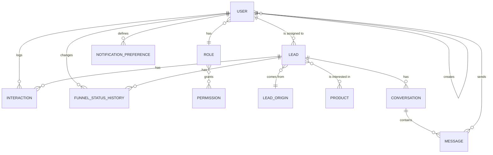

# Entidades e Propriedades do Sistema

> Documento complementar ao [Estudo de Caso](./01-estudo-de-caso-coleta-leads.md). Detalha as entidades do modelo de dados, suas propriedades e tipos, servindo de base para o desenho do schema do banco (PostgreSQL) e das APIs. Nomes de entidades, campos e valores de enum estão em **inglês**, seguindo o padrão de codificação do projeto; as descrições permanecem em português para facilitar a validação com o time de negócio.

---

## Diagrama de Relacionamento

---

## User

Conta interna de quem opera o sistema (vendedor ou gestor/administrador). Nunca criada por autocadastro — sempre por outro usuário com permissão para tal.

| Campo | Tipo | Obrigatório | Descrição |
|---|---|---|---|
| `id` | UUID | Sim | Identificador único |
| `name` | String | Sim | Nome do usuário |
| `email` | String | Sim | Usado como login; único |
| `password_hash` | String | Sim | Hash da senha (nunca a senha em texto puro) |
| `role_id` | FK → Role | Sim | Papel atribuído (ex.: Salesperson, Manager/Administrator) |
| `active` | Boolean | Sim | Permite desativar acesso sem apagar o histórico associado ao usuário |
| `created_by_id` | FK → User (nullable) | Não* | Usuário que fez o cadastro; nulo apenas para o primeiro usuário administrador criado na implantação inicial |
| `created_at` | Timestamp | Sim | Data/hora de criação |
| `updated_at` | Timestamp | Sim | Data/hora da última atualização |

## Role

Agrupa um conjunto de permissões (ex.: Salesperson, Manager/Administrator). Um papel pode ser reaproveitado por vários usuários.

| Campo | Tipo | Obrigatório | Descrição |
|---|---|---|---|
| `id` | UUID | Sim | Identificador único |
| `name` | String | Sim | Ex.: "Salesperson", "Manager/Administrator" |
| `description` | Texto | Não | Explicação do papel para quem administra o sistema |
| `permissions` | Lista → Permission (N:N) | Sim | Conjunto de permissões concedidas a este papel |

## Permission

Ação ou recurso do sistema que pode ser concedido a um papel.

| Campo | Tipo | Obrigatório | Descrição |
|---|---|---|---|
| `id` | UUID | Sim | Identificador único |
| `key` | String | Sim | Identificador técnico único, ex.: `CREATE_USER`, `VIEW_ALL_LEADS`, `VIEW_OWN_LEADS`, `EDIT_CATALOG`, `VIEW_METRICS`, `TRIGGER_PROSPECTING` |
| `description` | String | Sim | Explicação legível da permissão |

## NotificationPreference

Canal(is) por onde um usuário deseja ser notificado quando não está com o sistema aberto. Um usuário pode ter mais de uma preferência ativa (ex.: WhatsApp **e** e-mail).

| Campo | Tipo | Obrigatório | Descrição |
|---|---|---|---|
| `id` | UUID | Sim | Identificador único |
| `user_id` | FK → User | Sim | Usuário dono da preferência |
| `channel` | Enum: `WHATSAPP`, `TELEGRAM`, `EMAIL` | Sim | Canal de notificação |
| `contact` | String | Sim | Número de WhatsApp, chat ID do Telegram ou e-mail, conforme o canal |
| `active` | Boolean | Sim | Permite o usuário desativar um canal sem apagar o cadastro dele |

## Product

Item do catálogo, oferecido durante a qualificação e a proposta ao lead.

| Campo | Tipo | Obrigatório | Descrição |
|---|---|---|---|
| `id` | UUID | Sim | Identificador único |
| `name` | String | Sim | Nome do produto |
| `type` | Enum: `READY_MADE`, `CUSTOM` | Sim | Se é um produto padronizado ou sob medida |
| `description` | Texto | Sim | Descrição apresentável ao lead |
| `min_price_cents` | Integer | Não | Valor mínimo de referência, em centavos (ex.: R$ 1.500,00 = `150000`); produtos personalizados podem não ter faixa fechada |
| `max_price_cents` | Integer | Não | Valor máximo de referência, em centavos |
| `active` | Boolean | Sim | Permite descontinuar um produto sem apagar histórico de leads associados |
| `created_at` | Timestamp | Sim | Data/hora de criação |

## LeadOrigin

Registra de onde um lead veio — unifica contato direto e busca local, já que os dois convergem para o mesmo funil, mas guardam informações diferentes.

| Campo | Tipo | Obrigatório | Descrição |
|---|---|---|---|
| `id` | UUID | Sim | Identificador único |
| `origin_type` | Enum: `DIRECT_CONTACT`, `LOCAL_SEARCH` | Sim | Define quais dos campos abaixo se aplicam |
| `channel` | Enum: `META_WHATSAPP`, `META_INSTAGRAM`, `META_MESSENGER`, `TELEGRAM`, `WEBSITE` (nullable) | Apenas se `DIRECT_CONTACT` | Canal pelo qual o lead chegou |
| `search_source` | Enum: `GOOGLE_MAPS`, `CNPJ_FEDERAL_REVENUE`, `GROUP` (nullable) | Apenas se `LOCAL_SEARCH` | Fonte pública usada na prospecção |
| `region` | String (nullable) | Apenas se `LOCAL_SEARCH` | Região/cidade pesquisada |
| `search_segment` | String (nullable) | Apenas se `LOCAL_SEARCH` | Segmento/palavra-chave usada na busca |
| `capture_method` | Enum: `MANUAL`, `API`, `AUTOMATED` | Sim | `MANUAL` = cadastrado pelo vendedor (Meta/Telegram/grupos); `API` = recebido via chamada de API do site; `AUTOMATED` = trazido pelo serviço de prospecção (Google Maps/CNPJ) |

## Lead

Pessoa ou empresa em prospecção, seja por contato direto (inbound) ou busca local (outbound).

| Campo | Tipo | Obrigatório | Descrição |
|---|---|---|---|
| `id` | UUID | Sim | Identificador único |
| `name` | String | Sim | Nome do lead ou da empresa |
| `lead_type` | Enum: `DIRECT_CONTACT`, `LOCAL_SEARCH` | Sim | Espelha `LeadOrigin.origin_type`, mantido no Lead para consultas/filtragem rápida |
| `phone` | String | Não | Contato telefônico/WhatsApp |
| `email` | String | Não | Contato por e-mail |
| `initial_message` | Texto | Não | Mensagem/contexto trazido no primeiro contato (contato direto) ou observação do vendedor ao encontrar o lead (busca local) |
| `estimated_budget_cents` | Integer | Não | Orçamento estimado informado durante a qualificação, em centavos |
| `desired_timeline` | String | Não | Urgência informada pelo lead (ex.: "imediato", "em 3 meses") |
| `qualification_score` | Enum: `HIGH`, `MEDIUM`, `LOW` | Não | Resultado da qualificação automática |
| `funnel_status` | Enum: `NEW`, `CONTACTED`, `PROPOSAL`, `NEGOTIATION`, `CLOSED`, `LOST` | Sim | Etapa atual no funil comercial |
| `loss_reason` | Texto (nullable) | Apenas se `LOST` | Motivo registrado ao perder o lead |
| `origin_id` | FK → LeadOrigin | Sim | Canal/fonte de onde o lead veio |
| `assigned_user_id` | FK → User | Sim | Vendedor responsável pelo lead |
| `products_of_interest` | Lista → Product (N:N) | Não | Um ou mais produtos de interesse do lead |
| `created_at` | Timestamp | Sim | Data/hora de criação do registro |
| `updated_at` | Timestamp | Sim | Data/hora da última atualização |

## Conversation

Linha de comunicação por chat entre o vendedor e o lead, em um canal específico. Um lead pode ter mais de uma conversa (ex.: uma no WhatsApp e outra no Telegram).

| Campo | Tipo | Obrigatório | Descrição |
|---|---|---|---|
| `id` | UUID | Sim | Identificador único |
| `lead_id` | FK → Lead | Sim | Lead ao qual a conversa pertence |
| `channel` | Enum: `META_WHATSAPP`, `META_INSTAGRAM`, `META_MESSENGER`, `TELEGRAM` | Sim | Canal de chat usado nesta conversa (não inclui `WEBSITE`, que não é um canal de conversa contínua) |
| `external_thread_id` | String | Sim | Identificador da conversa no provedor externo (ex.: número de telefone no formato WhatsApp, `chat_id` do Telegram) — usado para rotear mensagens recebidas via webhook para a conversa correta |
| `status` | Enum: `OPEN`, `CLOSED` | Sim | Permite arquivar conversas encerradas sem apagar o histórico |
| `created_at` | Timestamp | Sim | Data/hora de criação |
| `updated_at` | Timestamp | Sim | Data/hora da última mensagem (usado para ordenar a inbox por mais recente) |

## Message

Cada mensagem trocada dentro de uma Conversation — enviada pelo vendedor através do sistema ou recebida do lead via webhook do canal.

| Campo | Tipo | Obrigatório | Descrição |
|---|---|---|---|
| `id` | UUID | Sim | Identificador único |
| `conversation_id` | FK → Conversation | Sim | Conversa à qual a mensagem pertence |
| `direction` | Enum: `INBOUND`, `OUTBOUND` | Sim | `INBOUND` = enviada pelo lead; `OUTBOUND` = enviada pelo vendedor |
| `sender_user_id` | FK → User (nullable) | Apenas se `OUTBOUND` | Vendedor que enviou a mensagem; nulo em mensagens `INBOUND`, que vêm do lead |
| `content` | Texto | Sim | Conteúdo textual da mensagem |
| `media_url` | String (nullable) | Não | URL de mídia anexada (imagem, áudio, documento), quando houver |
| `external_message_id` | String (nullable) | Não | Identificador da mensagem no provedor externo, usado para correlacionar atualizações de status |
| `status` | Enum: `PENDING`, `SENT`, `DELIVERED`, `READ`, `FAILED` | Sim | Status de entrega, relevante principalmente para mensagens `OUTBOUND` |
| `sent_at` | Timestamp | Sim | Data/hora de envio (vendedor) ou de recebimento (lead) |

## Interaction

Histórico de contatos com o lead que **não** são mensagens de chat — ligações e observações do vendedor. Mensagens de chat ficam em `Conversation`/`Message`.

| Campo | Tipo | Obrigatório | Descrição |
|---|---|---|---|
| `id` | UUID | Sim | Identificador único |
| `lead_id` | FK → Lead | Sim | Lead ao qual a interação pertence |
| `user_id` | FK → User | Sim | Autor do registro (quem interagiu) |
| `type` | Enum: `CALL`, `NOTE` | Sim | Natureza da interação |
| `content` | Texto | Sim | Resumo da ligação ou observação |
| `created_at` | Timestamp | Sim | Data/hora da interação |

## FunnelStatusHistory

Rastreia as transições de etapa de um lead ao longo do funil, permitindo calcular métricas como tempo até fechamento e taxa de perda por etapa.

| Campo | Tipo | Obrigatório | Descrição |
|---|---|---|---|
| `id` | UUID | Sim | Identificador único |
| `lead_id` | FK → Lead | Sim | Lead que mudou de etapa |
| `previous_status` | Enum (mesmos valores de `Lead.funnel_status`, nullable) | Não | Nulo na primeira transição (criação do lead como `NEW`) |
| `new_status` | Enum (mesmos valores de `Lead.funnel_status`) | Sim | Etapa para a qual o lead mudou |
| `user_id` | FK → User | Sim | Quem realizou a mudança de etapa |
| `reason` | Texto (nullable) | Apenas transição para `LOST` | Motivo da perda, espelhado em `Lead.loss_reason` |
| `changed_at` | Timestamp | Sim | Data/hora da transição |

---

## Observações

- **Padrão monetário do projeto**: todo valor monetário é armazenado como **inteiro em centavos** (`_cents`), nunca em ponto flutuante/decimal, para evitar erros de arredondamento — conversão para exibição (ex.: `R$ 1.500,00`) é responsabilidade da camada de apresentação. Este padrão vale para `Product.min_price_cents`, `Product.max_price_cents`, `Lead.estimated_budget_cents` e qualquer novo campo monetário adicionado ao sistema.
- Os campos marcados como `nullable`/"Não" (obrigatório) variam conforme o `lead_type`/`origin_type` — a validação de obrigatoriedade condicional deve ser garantida na camada de aplicação (ver `02-bibliotecas-e-apis.md`, Spring Validation / Zod), não apenas no banco.
- `Lead.lead_type` e `Lead.funnel_status` como enums simples (em vez de tabelas à parte) refletem que são conjuntos de valores fixos e pequenos, conforme definidos no estudo de caso; podem evoluir para tabelas próprias se o negócio passar a precisar de etapas/tipos configuráveis.
- `LeadOrigin.capture_method` existe para diferenciar, na prática, os três jeitos de um lead entrar no sistema hoje: cadastro manual pelo vendedor (Meta/Telegram/grupos), chamada de API feita pelo site (fora do escopo deste projeto) e busca automatizada do serviço de prospecção (Google Maps/CNPJ-Receita Federal).
- **`Conversation`/`Message` vs. `Interaction`**: a criação do `Lead` continua manual para Meta/Telegram, mas a partir daí toda mensagem trocada com o cliente é registrada automaticamente pelo serviço de mensageria em `Message`, dentro de uma `Conversation` — não é digitada manualmente pelo vendedor. `Interaction` fica reservada para contatos que não passam pelo chat do sistema (ligações telefônicas, observações internas).
- Uma `Conversation` não existe para o canal `WEBSITE`: o formulário do site gera um `Lead`, mas a conversa subsequente com esse lead acontece por WhatsApp ou Telegram, como qualquer outra.
