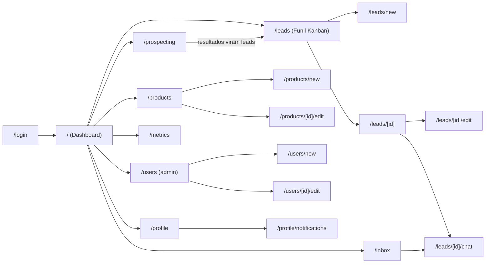

# Rotas e Telas do Sistema

> Documento complementar ao [Estudo de Caso](./01-estudo-de-caso-coleta-leads.md), ao [Modelo de Entidades](./03-entidades.md) e às [Bibliotecas e APIs](./02-bibliotecas-e-apis.md). Lista as telas do frontend (Next.js), suas rotas e a permissão necessária para acessá-las. Nomes de rota e de permissão seguem o padrão do projeto (código em inglês); descrições ficam em português.

---

## Convenções

- **Roteamento**: Next.js App Router — cada linha das tabelas abaixo corresponde a um segmento de rota (`app/leads/page.tsx`, `app/leads/[id]/page.tsx`, etc.).
- **`(auth)` vs `(app)`**: duas árvores de rota separadas por um *route group* — `(auth)` contém apenas as telas públicas de acesso; `(app)` contém todas as telas internas, protegidas por middleware que exige sessão válida e a permissão indicada na coluna "Permissão".
- **Sem autocadastro**: propositalmente **não existe** rota de registro público (`/register`, `/signup`) — reflexo direto do modelo de acesso definido no estudo de caso. A única forma de um usuário existir é sendo criado por quem tem a permissão `CREATE_USER`.
- **Permissão "—"**: tela acessível a qualquer usuário autenticado, independente de papel.
- Os valores da coluna "Permissão" usam as mesmas chaves definidas em [`03-entidades.md`](./03-entidades.md#permission) (`Permission.key`).

---

## Mapa de Navegação

---

## Autenticação `(auth)`

| Tela | Rota | Permissão | Descrição |
|---|---|---|---|
| Login | `/login` | — (pública) | Único ponto de entrada no sistema; e-mail e senha de um usuário já cadastrado. Sem link de "criar conta". |
| Definir senha (convite) | `/invite/[token]` | — (pública, token de convite) | Aberta a partir de um link gerado pelo administrador ao criar um usuário; define a senha inicial. |
| Redefinir senha | `/reset-password/[token]` | — (pública, token de recuperação) | Aberta a partir de um link enviado pelo canal de notificação do usuário; recuperação sempre iniciada por um fluxo com token, nunca por autocadastro. |

---

## Funil de Leads `(app)`

| Tela | Rota | Permissão | Descrição |
|---|---|---|---|
| Dashboard | `/` | — | Visão geral ao entrar: leads recentes, notificações, atalhos para as áreas principais. |
| Funil (Kanban) | `/leads` | `VIEW_OWN_LEADS` (vê os seus) ou `VIEW_ALL_LEADS` (vê todos) | Quadro com colunas por etapa do funil (Novo → Contatado → Proposta → Negociação → Fechado/Perdido); cards arrastáveis; filtro por tipo de lead (Contato Direto/Busca Local) e por canal/fonte. |
| Novo lead (cadastro manual) | `/leads/new` | `VIEW_OWN_LEADS` | Formulário para o vendedor registrar manualmente um lead recebido pela Meta (WhatsApp/Instagram/Messenger) ou Telegram — **não é usado para leads do site**, que chegam via API (ver seção de rotas de API abaixo). |
| Detalhe do lead | `/leads/[id]` | `VIEW_OWN_LEADS` (se responsável) ou `VIEW_ALL_LEADS` | Dados de qualificação, origem, produtos de interesse, histórico de interações e histórico de mudança de etapa do funil. |
| Editar lead | `/leads/[id]/edit` | `VIEW_OWN_LEADS` (se responsável) ou `VIEW_ALL_LEADS` | Atualiza dados de qualificação, produtos de interesse e o responsável pelo lead. |
| Registrar interação | `/leads/[id]/interactions/new` | `VIEW_OWN_LEADS` (se responsável) ou `VIEW_ALL_LEADS` | Registra ligação ou observação sobre o lead (mensagens de chat ficam na tela de Conversa, não aqui). |
| Mudar etapa / marcar perdido | `/leads/[id]/status` | `VIEW_OWN_LEADS` (se responsável) ou `VIEW_ALL_LEADS` | Move o lead de etapa no funil; exige motivo ao marcar como Perdido. |

---

## Mensagens (Chat) `(app)`

| Tela | Rota | Permissão | Descrição |
|---|---|---|---|
| Inbox (todas as conversas) | `/inbox` | `VIEW_OWN_LEADS` (vê as suas) ou `VIEW_ALL_LEADS` (vê todas) | Lista unificada das conversas de todos os leads, ordenada pela mensagem mais recente; indica conversas com mensagem não lida. |
| Conversa do lead | `/leads/[id]/chat` | `VIEW_OWN_LEADS` (se responsável) ou `VIEW_ALL_LEADS` | Histórico de mensagens trocadas com o lead e campo para o vendedor enviar novas mensagens; se o lead tiver conversas em mais de um canal (WhatsApp e Telegram), permite alternar entre elas. Mensagens novas chegam em tempo real (WebSocket). |

---

## Prospecção (Busca Local) `(app)`

| Tela | Rota | Permissão | Descrição |
|---|---|---|---|
| Buscar empresas | `/prospecting` | `TRIGGER_PROSPECTING` | Define região e segmento; dispara busca automatizada via Google Maps e portais de CNPJ/Receita Federal. |
| Resultados da busca | `/prospecting/[searchId]/results` | `TRIGGER_PROSPECTING` | Lista as empresas encontradas na busca; permite selecionar quais viram Lead (tipo Busca Local) no funil. |
| Levantamento manual (grupos) | `/prospecting/manual-entry` | `TRIGGER_PROSPECTING` | Cadastro manual de empresas encontradas em grupos, com região e fonte informadas à mão. |

---

## Catálogo de Produtos `(app)`

| Tela | Rota | Permissão | Descrição |
|---|---|---|---|
| Lista de produtos | `/products` | — | Consulta de produtos prontos e personalizados; usada também ao vincular um produto a um lead. |
| Novo produto | `/products/new` | `EDIT_CATALOG` | Cadastro de produto (nome, tipo, descrição, faixa de preço). |
| Editar produto | `/products/[id]/edit` | `EDIT_CATALOG` | Atualização ou desativação de um produto existente. |

---

## Usuários e Permissões `(app)`

| Tela | Rota | Permissão | Descrição |
|---|---|---|---|
| Lista de usuários | `/users` | `CREATE_USER` | Todos os usuários cadastrados, papel e status (ativo/inativo). |
| Novo usuário | `/users/new` | `CREATE_USER` | Cadastra um novo usuário e papel; gera o link de convite (`/invite/[token]`). |
| Editar usuário | `/users/[id]/edit` | `CREATE_USER` | Altera papel, ativa/desativa acesso. |
| Papéis e permissões | `/settings/roles` | `CREATE_USER` | Matriz de papéis (Salesperson, Manager/Administrator) e as permissões concedidas a cada um. |

---

## Perfil e Notificações `(app)`

| Tela | Rota | Permissão | Descrição |
|---|---|---|---|
| Meu perfil | `/profile` | — | Dados do próprio usuário logado; troca de senha. |
| Preferências de notificação | `/profile/notifications` | — | Cada usuário escolhe por quais canais quer ser notificado quando estiver fora do sistema (WhatsApp, Telegram e/ou e-mail) e informa o contato de cada canal. |

---

## Métricas `(app)`

| Tela | Rota | Permissão | Descrição |
|---|---|---|---|
| Métricas do funil | `/metrics` | `VIEW_METRICS` | Taxa de conversão por canal e por tipo de lead, tempo médio de primeira resposta, taxa de fechamento por etapa, produtos mais ofertados. |
| Métricas de prospecção | `/metrics/prospecting` | `VIEW_METRICS` | Volume de leads de busca local por região e por fonte (Google Maps vs. CNPJ/Receita Federal vs. grupos). |

---

## Rotas de API sem tela associada

Algumas rotas existem apenas no backend, sem uma tela correspondente no frontend, por serem chamadas por sistemas externos:

| Rota | Método | Chamada por | Descrição |
|---|---|---|---|
| `/api/public/leads` | `POST` | Site institucional (fora do escopo deste projeto) | Endpoint público autenticado por token de integração; recebe a submissão do formulário de contato do site e cria automaticamente um `Lead` com `LeadOrigin.channel = WEBSITE` e `capture_method = API`. |
| `/api/webhooks/whatsapp` | `GET` (verificação) / `POST` (eventos) | Meta (WhatsApp Business Platform) | `GET` responde ao desafio de verificação do webhook exigido pela Meta; `POST` recebe mensagens do lead e atualizações de status de entrega/leitura, gravando em `Message` dentro da `Conversation` correspondente. |
| `/api/webhooks/telegram` | `POST` | Telegram Bot API | Recebe as mensagens que o lead envia ao bot, gravando em `Message` dentro da `Conversation` correspondente. |

---

## Observações

- Rotas sob `(app)` são todas protegidas por middleware de autenticação; a permissão indicada é verificada tanto no frontend (para exibir/ocultar a navegação) quanto no backend (para não depender apenas do controle de UI).
- `/leads/new` e `/prospecting/manual-entry` cobrem os dois casos de **cadastro manual** definidos no estudo de caso (Meta/Telegram e grupos, respectivamente); nenhuma tela cria leads com `channel = WEBSITE`, pois esses só entram via `/api/public/leads`.
- A criação do `Lead` continua manual para Meta/Telegram, mas a **conversa seguinte** já acontece pelo sistema desde o MVP, via `/leads/[id]/chat` e `/inbox`, alimentadas pelos webhooks `/api/webhooks/whatsapp` e `/api/webhooks/telegram`.
- `/leads/[id]/chat` não existe para leads cuja origem é `WEBSITE` sem nenhuma `Conversation` ainda aberta — o vendedor inicia a conversa manualmente por WhatsApp ou Telegram depois do primeiro contato pelo formulário do site.
- Este documento cobre o MVP. Telas para canais futuros (novas redes sociais) e para a criação automática do lead a partir da primeira mensagem serão adicionadas quando essas funcionalidades entrarem em escopo.
